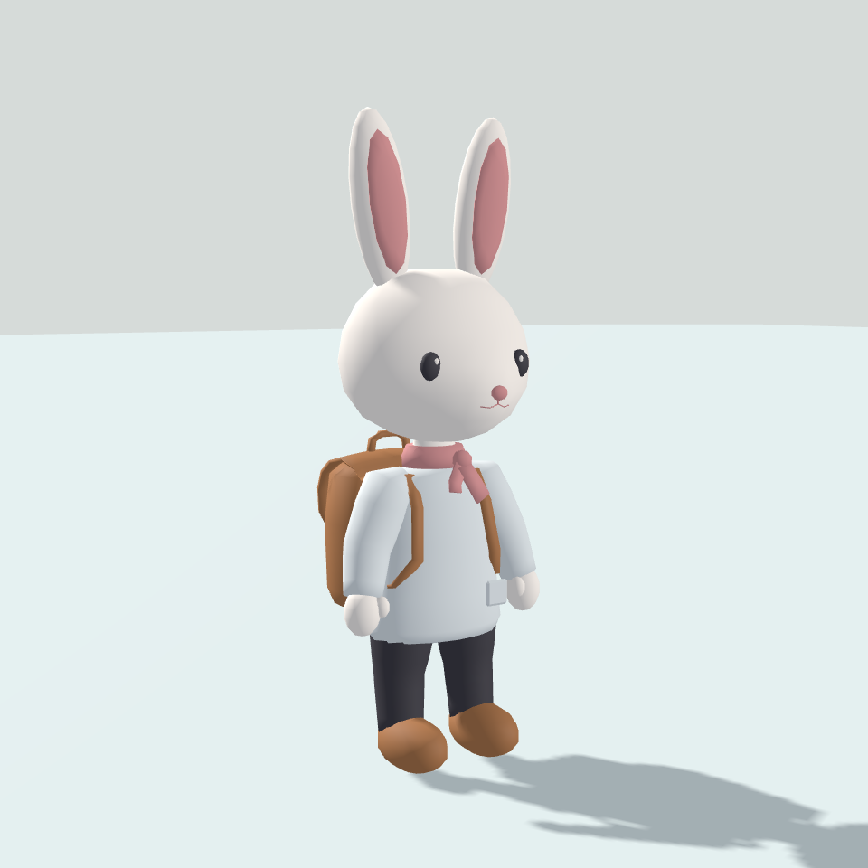
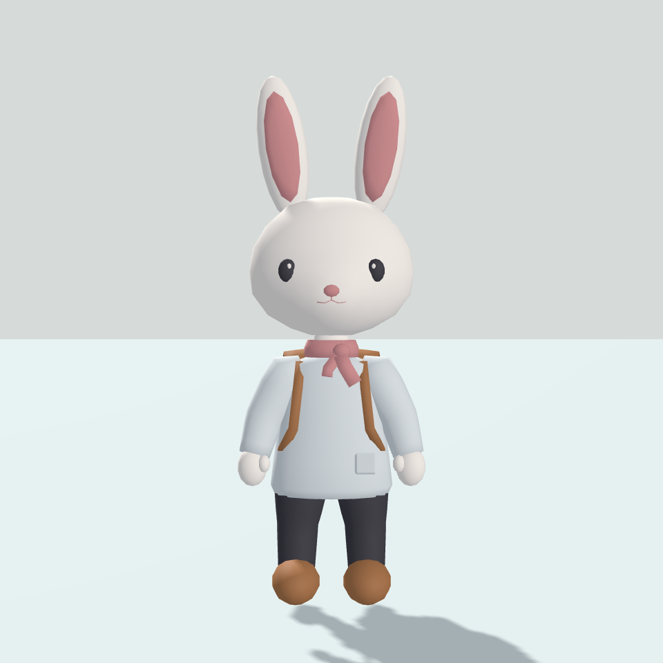

# 귀·어깨선·목도리 조정 — v0.67

후속 v0.78: 남은 관통을 걷기 96시점과 전환을 포함한 317시점으로 다시 검사했다. 앞쪽 여유 추가 최대 2cm·추종 최대 45%·중앙 연속 보간으로 보완했다. 기존 24시점 1mm 초과/최대 19.07mm → 최종 동일 검사에서 돌출 0. 앞쪽 광선·정점 검사라는 한계가 있으며 실제 입력·모든 면 교차를 검증한 것은 아니다. 두 Windows 빌드·기존 자동 회귀 통과. 사용자 확인 대기.

후속 v0.77: 코트 하단에 허벅지 추종 가중치를 최대 38% 적용하고 앞쪽 여유 최대 4.5cm를 추가했다. 중앙은 양쪽 허벅지로 분산하고 안감·겉감을 함께 수정했다. 기존 모델 예산·골격·애니메이션은 유지한다. 정면·측면 Passing 및 출발 렌더에서 기존 무릎 관통 개선을 확인했다. 자동 회귀 검사·두 Windows 빌드 통과, 실제 연속 재생 관통 확인은 사용자 대기다.

후속 v0.74: 눈 하이라이트의 흰 타원체를 실제 눈 표면에 밀착하는 패치로 교체했다. 크기·위치와 기존 재질 반사는 유지하며 표면 간격 0.5mm로 배치했다. 전체 5,864삼각형·착용 4,604삼각형·재질 6개. 확대 렌더에서 돌출 감소를 확인했고 실제 연속 재생의 깜빡임·가림은 사용자 확인 대기다. 이전은 `Captures/AdultRabbitBeforeV074`에 보존했다.

후속 v0.73 — 얼굴 외형 사용자 확인 대기: 주둥이 추가 돌출을 절반으로 낮추고 눈·코를 실제 얼굴 표면 중심에 배치하여 표면 법선에 맞춰 회전했다. 두께 약 절반을 매립하며 눈 하이라이트도 함께 이동했다. 코 아래 및 양쪽 입선을 제거했다. 머리 폭·눈 간격·눈/코 크기·골격·동작 타이밍은 유지한다. 전체 5,888삼각형·착용 4,628삼각형·재질 6개. 외형/동작 회귀 검사와 두 Windows 빌드 통과, 실제 입력은 미실시다. 수정 전은 `Captures/AdultRabbitBeforeV073`에 보존했다.

[정면 확대](Captures/AdultRabbit/FaceFront.png) · [측면 확대](Captures/AdultRabbit/FaceSide.png) · [비스듬한 확대](Captures/AdultRabbit/FaceQuarter.png)

후속 v0.69: 상의 밑단을 코트처럼 길고 넓게 벌렸다. 밑단에 막힌 바닥판을 두지 않고 안감과 얇은 테두리를 구성해 바지와 공간을 분리했다. 포켓을 새 표면에 맞췄다. 골격·얼굴·목도리·배낭은 그대로다. 자동 회귀 검사·Windows 빌드 통과와 정면/측면/[낮은 시점](Captures/AdultRabbit/CoatHemLow.png) 렌더 확인을 마쳤다. 실제 입력·외형 승인은 대기이며 코트 물리나 동작 중 관통 해결까지 완료한 것은 아니다. 수정 전은 `Captures/AdultRabbitBeforeV069`에 보존했다.

후속 v0.68: 목도리 목둘레만 원뿔대 형태로 변경했다. 상단 반지름 0.100/0.085m, 하단 0.160/0.138m로 옆선에 경사를 주고 중간 단면도 경사에 맞췄다. 매듭과 앞쪽 끝은 유지한다. 아래 이미지 경로는 최신 재생성 결과를 표시한다.

2026-09-22 / 외형 사용자 확인 대기

## 변경

- 귀 바닥을 유지하며 긴 축 반지름을 0.335→0.245m로 줄이고 중심도 긴 축을 따라 내려 머리 위 노출 길이를 약 30% 줄였다. 안쪽 분홍 영역도 축소했다. 흰 점처럼 보이던 면 겹침은 안쪽 메시 간격을 보완했다.
- 기본 몸과 상의 어깨에 두 단계 연결 단면을 배치해 목에서 위팔로 둥글게 내려오도록 했다. 관절 간격 0.408m와 모든 바인드 골격은 그대로이며 `AdultStandard_v2` 호환을 유지한다. 얼굴·머리·몸통 하부·배낭은 변경하지 않았다.
- 목도리 띠·매듭은 약 15%, 끝 폭은 약 25%, 긴 끝의 세로 길이는 약 50% 확대했다. 두 갈래 끝의 길이·접힘을 달리했다.
- 전체 5,948삼각형, 착용 4,688삼각형, 8스킨 렌더러, 재질 6개. Subdivision 없음. 저사양 PC 성능 보장 수치는 아니다.

## 같은 구도의 전후 비교

| 구도 | 이전 v0.66 | 현재 v0.67 |
|---|---|---|
| 비스듬한 앞 |  |  |
| 정면 |  |  |

## 검증과 남은 확인

- 자동: 전체 높이 2.18~2.23m, 머리 폭 0.752m·어깨 관절 간격 0.408m, 삼각형·재질 예산, 탈착·몸 복원·v1 규격 거부·v2 재연결·반복 생성 보존 통과. 상의/목도리/배낭의 8가지 조합에서 몸 표시 상태를 검사하고 캡처했다.
- 렌더: 정면·측면·후측면·작은 화면과 8가지 착용 조합·팔 굽힘을 별도 카메라 렌더로 확인했다. 자동 상태 검사는 메시 관통이나 디자인 품질 전체를 보증하지 않는다.
- 최종 자동 검사·Windows 빌드 종료 코드 0 및 성공 표식 확인. 검토 프로그램을 1280×900으로 실행해 프로세스 응답·그래픽/입력 초기화와 시작 로그의 예외 없음까지 확인했다. 로그는 `Logs/adult-rabbit-v067-player-start.log`다. 실제 조작 검증을 대신하지 않는다.
- 기존 깊은 굽힘의 의상·배낭 간섭과 발 접지는 후속이다. 상의를 벗고 바지를 유지하면 기본 몸과 바지 허리 경계가 고르지 않은 기존 문제도 남아 있다. 이번 요청 외의 몸통 하부·바지 수정은 수행하지 않았다.
- 실제 Game/실행 창 입력과 사용자 외형 확인은 대기다. 다음 순서는 외형 확인 후 리깅·애니메이션 보완이다. GitHub 업로드는 이번에 수행하지 않는다.
