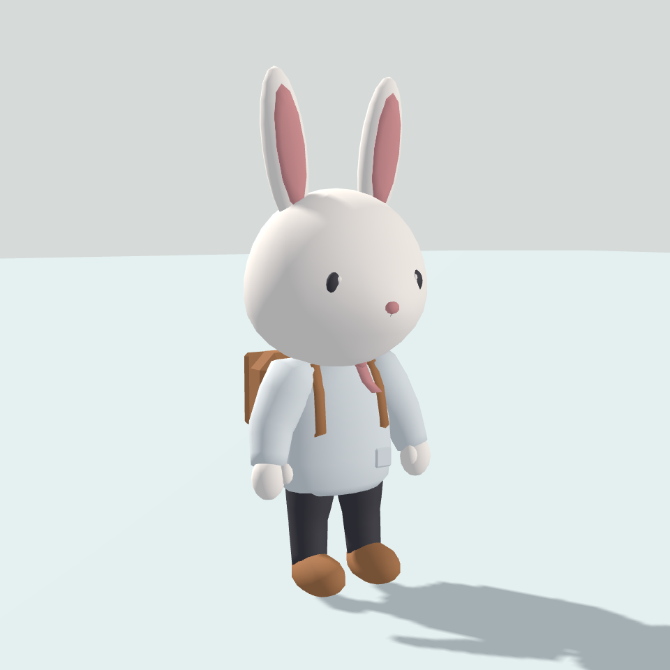
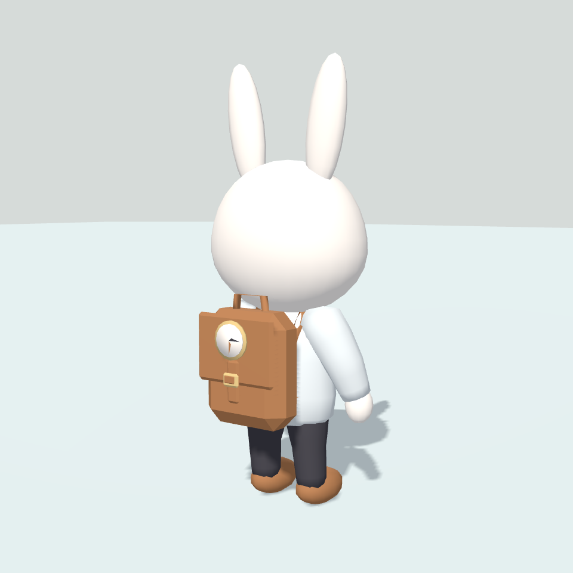

# 성인 토끼 재디자인 — v0.66

2026-09-22 / 디자인 사용자 확인 대기. v0.65는 승인되지 않은 초안이다.

## 변경과 근거

참고 이미지 `References/Char_Rabbit_01_high.png`의 볼·턱·주둥이 실루엣을 수평 단면으로 구성했다. 머리 폭은 기존 0.89m 기준 약 15% 축소, 어깨 관절 간격은 0.51→0.408m로 축소했다. 귀·소매·손·상의 단면도 함께 조정하고 머리 아래에 목수건 띠와 매듭·두 갈래 끝이 보이게 했다. 배낭은 둥근 단면 몸통과 윗면에서 전면으로 내려오는 두께 있는 곡면 덮개로 교체했다. 끈의 단면은 경로 방향을 따라 회전시켜 옆에서 선처럼 보이던 현상을 보완했다.

한 장의 이미지에 보이지 않는 면은 같은 형태 원칙으로 구성했다. 미세 가죽 질감·바느질·고해상도 렌더 조명을 동일하게 재현한 결과가 아니며, 기본 자세의 디자인을 먼저 확인한다.

## 동일 카메라 전후 비교

이전 PNG는 `Captures/AdultRabbitBeforeV2`에 복사 보존했다. 아래 비교는 동일 카메라·조명 설정이다. 가죽·금속의 거칠기는 이번 디자인에 맞춰 조정했다.

| 구도 | 미승인 초안 | 재디자인 |
|---|---|---|
| 앞쪽 |  |  |
| 배낭 |  |  |

[참고와 유사한 후측면](Captures/AdultRabbit/ReferenceAngle.png) · [배낭 확대](Captures/AdultRabbit/BackpackDetail.png) · [정면](Captures/AdultRabbit/Front.png) · [측면](Captures/AdultRabbit/Side.png) · [후면](Captures/AdultRabbit/Rear.png) · [작은 화면](Captures/AdultRabbit/Small.png)

## 검사와 남은 확인

- 전체 모듈 5,892삼각형, 전체 착용 4,680삼각형, 8스킨 렌더러, 재질 6개. Subdivision·이미지 텍스처 없음. 성능 보장이 아닌 제작 수치다.
- `AdultStandard_v2`로 골격·의상 바인드 정보를 함께 갱신했다. 이전 v1·다른 체형 거부, 3회 탈착·몸 복원, 별도 v2 골격에 동일 메시 재연결, 수동 영역 보존과 반복 생성 검사를 통과했다.
- 정면·측면·후면·확대·작은 화면 렌더를 확인했다. 정적 관절 굽힘과 낮은 자세에서 실제 정점 변형도 검사했다. 렌더는 변형 정점을 명시적으로 평가한 별도 카메라 캡처이며 실제 Game 입력 검증이 아니다.
- 깊은 굽힘에서는 배낭·상의·목수건 간섭과 발 접지 보완이 남는다. 외형 승인 후 리깅·애니메이션 단계에서 처리한다. 현재 기본 자세의 목수건 노출·머리 비율·배낭 모양은 사용자 확인 대기다.
- Blender 원본·FBX·코드·프리팹·의상 정의와 검토 실행 파일을 갱신한다. 기존 농가·다른 토끼·기존 애니메이션은 변경하지 않는다. GitHub 업로드는 별도 요청 전 수행하지 않는다.
- 최종 재생성·자동 검사·Windows 빌드 종료 코드 0, 두 성공 표식을 확인했다. `Logs/AdultRabbitPlayer/TinyDaysAdultRabbit.exe` 실행 후 창 생성·프로세스 응답·그래픽/입력 초기화와 시작 로그의 예외 없음도 확인했다. 실제 버튼 조작·Game 화면 입력 검증이나 디자인 승인을 의미하지 않는다. 실행 파일은 로컬 산출물이다.
