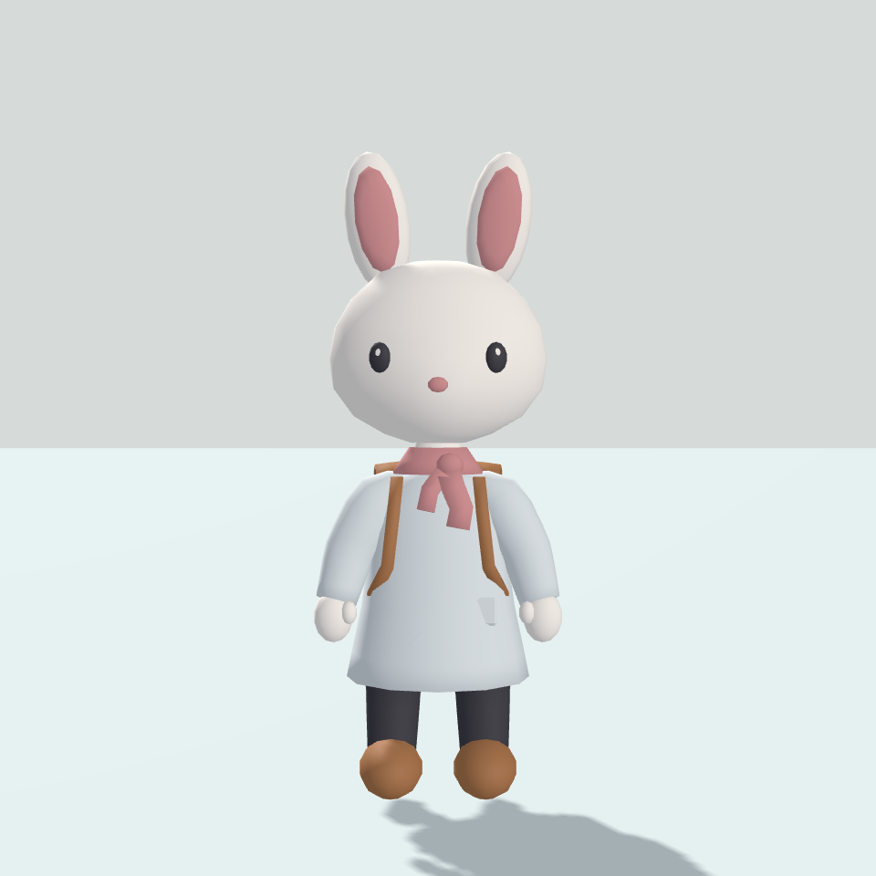
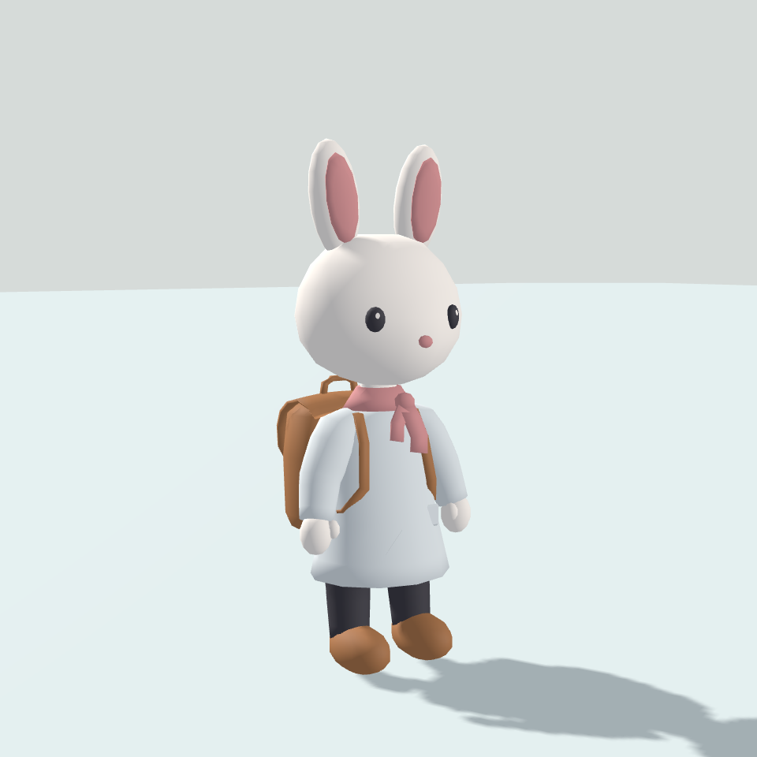
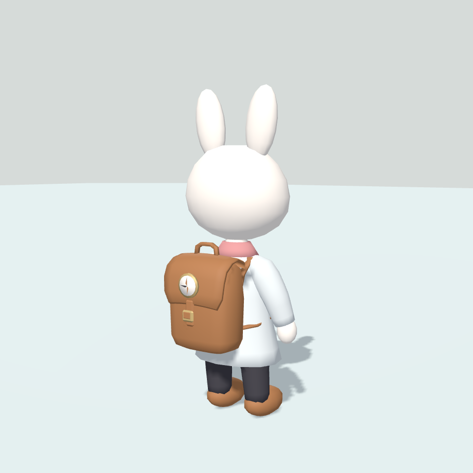

# 성인 토끼·공용 의상 첫 디자인 검토

2026-09-22 / MasterPlan v0.69 / **성인 토끼 재디자인 사용자 확인 대기**

v0.65 초안은 디자인 미승인이다. v0.66은 [재디자인 기록](AdultRabbitRedesign.md), 최신 v0.67은 [귀·어깨·목도리 조정](AdultRabbitAdjustment.md)을 따른다.

## 디자인

- 기준 이미지: [Char_Rabbit_01_high.png](References/Char_Rabbit_01_high.png). 큰 머리·볼·긴 귀·작은 눈·분홍 코, 흰 상의·짙은 바지·갈색 신발·목수건·배낭을 로우폴리로 단순화했다.
- Subdivision과 면 수를 늘리는 MeshSmooth를 사용하지 않는다. 둥근 부분은 Shade Smooth, 머리와 배낭은 명시적 단면 메시로 표현한다. 덮개는 두께 있는 연속 곡면이다. 단색 재질 6개를 사용하며 이미지 텍스처·그려 넣은 음영·미세 봉제선은 없다. 나침반 문양은 소수 삼각형으로 표현한다.
- 원본은 `ArtSource/AdultRabbit.blend`, 재생성 코드는 `Tools/generate_adult_rabbit.py`다. Unity 모델·의상 정의·프리팹은 `Assets/Art/Generated/AdultRabbit/`에 보존한다.
- 기존 농가 주민, RabbitStudy, RabbitMotion 및 기존 생성 코드는 교체하지 않았다.

## 열기와 조작

- Unity 장면: `Assets/Scenes/AdultRabbitStudy.unity`. 메뉴 `Tiny Days → Adult rabbit → Open design review`로 연 뒤 Play한다.
- Windows 검토 실행 파일: `Logs/AdultRabbitPlayer/TinyDaysAdultRabbit.exe`. 옆의 데이터 폴더와 DLL이 필요하다. Logs는 PC 간 Git 동기화 대상이 아니므로 다른 PC에서는 재빌드한다.
- 왼쪽 드래그 패닝, 오른쪽 드래그 회전, 휠 줌, Home 기본 구도. 하단에서 상의·바지·신발·목수건·배낭을 각각 탈착한다. 전체 착용·기본 몸·정면·뒷면·기본 자세·관절 굽힘·네 발 전환 검토 자세를 제공한다.
- 재생성: `powershell -ExecutionPolicy Bypass -File Tools/RebuildAdultRabbit.ps1 -BuildPlayer`. Unity에서 해당 프로젝트를 닫은 상태에서 실행한다. Blender 5.2.1 / Unity 2022.3.20f1의 기존 설치 경로를 사용한다. 검토 장면의 `ManualEdits`는 보존한다.

## 체형군과 장비 공유

- `Infant`(갓난아기), `Child`(어린아이), `Adult`(성인)를 별개 체형군으로 구분한다. 이번 실제 제작은 `AdultStandard_v2` 성인 토끼 하나다. v1 의상은 관절·바인드 변환이 달라 거부하며 새 메시·바인드 정보를 함께 생성한다.
- 같은 체형군과 공통 골격 규격을 사용하는 일반 종은 같은 의상 메시를 공유한다. 골격 규격에는 이름뿐 아니라 기준 자세·관절 위치·바인드 변환이 포함된다. 외형 승인 전인 성인 규격은 아직 출시 확정값이 아니다.
- `CharacterWearable`은 체형군·골격 규격·슬롯·메시·재질·뼈 이름·가려지는 몸 영역을 보존한다. `ModularCharacter`는 장착 전에 호환성과 뼈를 검사하고 기존 골격에 재연결한다. 거부 시 기존 장비를 유지한다.
- 상의가 몸통·팔, 하의가 다리, 신발이 발을 가린다. 벗으면 해당 몸이 복구된다. 목수건과 배낭은 독립적이다. 배낭 몸체는 BackSocket에 고정되고 끈은 Spine을 따른다.
- 체형군이 다르면 의상 디자인을 공유하더라도 맞춤 메시가 필요하다. 액세서리 원형·체형별 장착 변형은 후속 체형 제작 시 확인한다. 이번에 어린아이·갓난아기 또는 다른 종의 실제 호환을 검증한 것은 아니다.

## 제작 수치와 검사

| 범위 | 결과 |
|---|---:|
| 기본 몸과 장비 전체 자산 | 5,940삼각형 |
| 전체 자산 Unity 정점 | 3,292 |
| 의상·배낭 전체 착용 시 표시 | 4,680삼각형 |
| 착용 시 활성 스킨 렌더러 | 8 |
| 캐릭터 고유 재질 | 6 |

이는 제작 예산이며 저사양 PC 성능 보장이 아니다. 리뷰 바닥 재질은 캐릭터 재질 수에서 제외한다. 렌더러와 서브메시 분할은 추후 많은 주민을 배치할 때 측정한다.

- [자동 검사 결과](AdultRabbitVerification.txt): 반복 생성 시 수동 영역 보존, 삼각형 예산·가중치, 세 번 탈착·몸 복원, 다른 체형군·특수 규격 거부, 같은 장비 자산을 별도 성인 골격에 재연결했을 때 정점 위치 일치 통과.
- 관절 굽힘과 네 발 전환용 정적 자세에서 실제 정점 이동을 검사했다. 최초 검사에서 발견한 Root에만 연결된 가중치를 수정한 뒤 재검증했다. 배치 렌더는 현재 스킨 변형을 명시적으로 평가한 메시를 사용한다.
- 정면·측면·후면·비스듬한 구도·작은 화면 렌더를 확인했다. 귀 안쪽이 분리되어 보이던 부분을 표면에 맞추고, 어깨 연결·배낭 끈과 입 주변을 보완했다.
- 정적 자세는 변형 검토용이다. 깊게 숙일 때 상의 허리·끈·배낭과 머리 사이 간섭, 정확한 네 발 접지와 신발 방향은 애니메이션 작업에서 추가 보완이 필요하다. 완성된 네 발 애니메이션이나 관통 전 구간 통과로 간주하지 않는다.
- 실제 Game/독립 실행 창의 버튼·연속 입력 검증과 사용자 디자인 확인은 대기다. 먼저 얼굴·체형·의상 외형을 확인하고 그 뒤 리깅 보완과 걷기·깡충 움직임을 진행한다.

## 비교 이미지

Windows 검토 프로그램은 `Logs/AdultRabbitPlayer/TinyDaysAdultRabbit.exe`다. 최종 자동 검사와 빌드가 종료 코드 0으로 완료됐고 성공 표식을 확인했다. 1280×900 창 실행과 프로세스 응답·그래픽 초기화를 확인했다. 이는 실제 버튼 조작·Game 화면 확인을 대신하지 않는다. 실행 파일은 로컬 산출물이며 다른 PC에서는 재빌드한다.

[측면](Captures/AdultRabbit/Side.png) · [후면](Captures/AdultRabbit/Rear.png) · [작은 화면](Captures/AdultRabbit/Small.png) · [기본 몸](Captures/AdultRabbit/BaseBody.png) · [관절 굽힘](Captures/AdultRabbit/JointBend.png) · [네 발 변형 검토](Captures/AdultRabbit/QuadrupedProbe.png)
